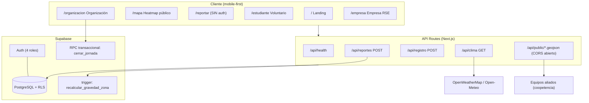

<div align="center">


# Parakeet

**Impacto ambiental medible, trazable y visible.**

Plataforma de voluntariado que conecta a la **comunidad que reporta** puntos contaminados, las **empresas que financian** iniciativas con su presupuesto de RSE y los **voluntarios que actúan** — dejando el impacto de cada acción visible en el mapa, en vivo.

*Hackathon de Turismo Creativo Vol. 1 · Reto 4: EcoTrack (turismo ecológico y sostenible)*

**Demo:** https://parakeet-gray.vercel.app

</div>

---

## Tabla de contenido

- [El modelo en una frase](#el-modelo-en-una-frase)
- [Stack](#stack)
- [Arquitectura](#arquitectura)
- [Estructura del proyecto](#estructura-del-proyecto)
- [Endpoints](#endpoints)
- [Instalación y ejecución](#instalación-y-ejecución)
- [Variables de entorno](#variables-de-entorno)
- [Base de datos](#base-de-datos)
- [Credenciales de prueba](#credenciales-de-prueba)
- [Estado de los componentes](#estado-de-los-componentes)
- [Coopetencia](#coopetencia)
- [Créditos](#créditos)

---

## El modelo en una frase

La comunidad **propone** iniciativas, las empresas las **financian** con su presupuesto de RSE, los voluntarios las **ejecutan** y cumplen sus horas sociales, y Parakeet conecta a las tres partes dejando impacto **medible, trazable y visible**.

### El ciclo de impacto

```
Reporte ciudadano (sin cuenta)
   └─> Zona sube de gravedad en el heatmap (trigger SQL)
         └─> Organización crea iniciativa desde la zona → publica
               └─> Empresa la financia (RSE, pago simulado)
                     └─> Voluntarios se inscriben y asisten
                           └─> Cierre de jornada (RPC transaccional):
                               horas + sellos + métricas de impacto
                               └─> La zona BAJA de gravedad en el mapa, en vivo
```

---

## Stack

| Capa | Tecnología | Por qué |
| --- | --- | --- |
| Framework | **Next.js 16** (App Router) + TypeScript · React 19 | Un solo proyecto sirve frontend y API routes; un solo deploy. |
| Estilos | **Tailwind CSS v4** (config CSS-first) + Inter | Sistema de diseño propio con tokens de marca (`pk-*`). |
| Backend / BD | **Supabase** (PostgreSQL + Auth + RLS) | Auth por rol, base relacional, Row Level Security declarativa y RPCs transaccionales sin escribir un backend. |
| Mapas | **Leaflet** + react-leaflet + OpenStreetMap | Sin API key, sin cuota. |
| Heatmap | **leaflet.heat** | La visualización que pide el reto, en un plugin. |
| Clima | **OpenWeatherMap** + Open-Meteo (respaldo) | Coopetencia — ver [créditos](#créditos). |
| Deploy | **Vercel** | `git push` → URL pública. |

---

## Arquitectura



**Decisiones clave**

- **Máquina de estados única** (`src/lib/iniciativas/transiciones.ts`): toda transición de una iniciativa pasa por ahí. `borrador → financiable → financiada → inscripcion_abierta → en_curso → completada` (+ `cancelada`).
- **Cierre de jornada transaccional** (RPC `cerrar_jornada`): acreditar horas, otorgar sellos, registrar métricas y bajar la gravedad de la zona es **todo o nada** — nunca quedan horas sin sello.
- **Reportes anónimos por diseño**: la tabla `reportes` no tiene FK a usuarios (maximiza la captación de datos sin fricción).
- **RLS en las 12 tablas**: la anon key solo lee datos públicos de dominio; escrituras sensibles pasan por Server Actions con service role.

---

## Estructura del proyecto

```
src/
├── app/
│   ├── page.tsx                    # Landing (propuesta de valor + métricas en vivo)
│   ├── mapa/                       # Heatmap público de zonas contaminadas
│   ├── reportar/                   # Reporte ciudadano (SIN auth, ≤3 taps)
│   ├── registro/                   # Alta de voluntario
│   ├── login/                      # Ingreso por rol
│   ├── estudiante/                 # Voluntario: catálogo, detalle, Green Passport
│   ├── organizacion/               # Org: panel, mapa, clima, crear/editar, jornada
│   ├── empresa/                    # Empresa: catálogo + top 3, mapa, financiamientos
│   ├── admin/                      # Métricas del ecosistema (read-only)
│   └── api/
│       ├── health/                 # GET  — verificación (+ /db para conexión BD)
│       ├── reportes/               # POST — reporte anónimo (asigna zona por Haversine)
│       ├── registro/               # POST — alta de voluntario
│       ├── clima/                  # GET  — clima por zona/fecha (coopetencia)
│       └── public/
│           ├── zonas.geojson/      # GET  — API PÚBLICA (coopetencia)
│           └── reportes.geojson/   # GET  — API PÚBLICA (coopetencia)
├── components/
│   ├── mapa/                       # HeatmapZonas, CapaZonasVivas, selectores
│   ├── iniciativa/                 # Catálogo, formularios, badges, jornada
│   ├── impacto/                    # Antes/después + tiles de métricas
│   ├── clima/                      # Mapa de clima por fecha
│   ├── landing/                    # Carrusel, contadores, perico
│   └── ui/                         # Navs por rol, encabezados, logo
├── lib/
│   ├── supabase/                   # Clientes: browser, server (SSR), admin
│   ├── iniciativas/                # transiciones.ts (máquina de estados) + acciones
│   ├── zonas/gravedad.ts           # Haversine + niveles + colores
│   └── database.types.ts           # Tipos de la BD
└── supabase/
    ├── schema.sql                  # Tablas + enums
    ├── functions.sql               # Trigger de gravedad + RPC cerrar_jornada
    ├── rls.sql                     # Row Level Security (12 tablas)
    ├── seed.sql                    # Zona piloto (Playa El Tunco) + reportes
    ├── seed-auth.mjs               # Cuentas de prueba por rol
    └── seed-datos.mjs              # Iniciativas de demo
```

---

## Endpoints

### API pública (coopetencia · CORS abierto · sin API key)

| Método | Endpoint | Descripción |
| --- | --- | --- |
| `GET` | `/api/public/reportes.geojson` | Puntos contaminados auto-reportados por ciudadanos. GeoJSON estándar: tipo de contaminación, descripción, fecha. Anónimos. |
| `GET` | `/api/public/zonas.geojson` | Zonas agregadas con `nivel_gravedad` (critico ≥10 · alto 5-9 · medio 2-4 · bajo 1 · recuperada), `total_reportes`, radio. |

Consumo en una línea (Leaflet):

```js
fetch('https://parakeet-gray.vercel.app/api/public/zonas.geojson')
  .then(r => r.json())
  .then(d => L.geoJSON(d).addTo(map));
```

Ejemplo de respuesta (`zonas.geojson`):

```json
{
  "type": "FeatureCollection",
  "metadata": { "nombre": "Parakeet — Zonas contaminadas", "licencia": "Datos abiertos — uso libre citando a Parakeet" },
  "features": [{
    "type": "Feature",
    "geometry": { "type": "Point", "coordinates": [-89.3823, 13.4936] },
    "properties": { "nombre": "Playa El Tunco", "nivel_gravedad": "critico", "total_reportes": 10, "radio_m": 300 }
  }]
}
```

### API interna

| Método | Endpoint | Auth | Descripción |
| --- | --- | --- | --- |
| `GET` | `/api/health` | — | Verificación del servicio (`200` + timestamp). |
| `GET` | `/api/health/db` | — | Verificación de conexión a Supabase. |
| `POST` | `/api/reportes` | — (anónimo) | Crea un reporte `{lat, lng, tipo_contaminacion, descripcion?}`. Asigna zona por distancia Haversine o crea una nueva; el trigger recalcula la gravedad. |
| `POST` | `/api/registro` | — | Alta de voluntario `{nombre, institucion, email, password}`. |
| `GET` | `/api/clima?lat&lon&fecha` | — | Clima por coordenada y fecha (YYYY-MM-DD). Fuente OpenWeatherMap con respaldo Open-Meteo. |

### Mutaciones por Server Actions (rol verificado en servidor)

Crear/editar/eliminar/publicar iniciativa, financiar (simulado), inscribirse (valida cupo y duplicados) y **cerrar jornada** (RPC transaccional: asistencia por persona → horas + sellos + métricas + baja de gravedad de zona).

---

## Instalación y ejecución

```bash
# 1. Clonar e instalar
git clone https://github.com/NehemiasRivas7/Parakeet.git
cd Parakeet
npm install

# 2. Variables de entorno
cp .env.example .env.local   # y completar con las claves de Supabase

# 3. Base de datos (Supabase → SQL Editor, en orden)
#    schema.sql → functions.sql → rls.sql → seed.sql

# 4. Cuentas de prueba y datos de demo
node --env-file=.env.local supabase/seed-auth.mjs
node --env-file=.env.local supabase/seed-datos.mjs

# 5. Desarrollo
npm run dev            # http://localhost:3000

# Verificar build de producción
npm run build
```

---

## Variables de entorno

| Variable | Descripción |
| --- | --- |
| `NEXT_PUBLIC_SUPABASE_URL` | URL del proyecto Supabase. |
| `NEXT_PUBLIC_SUPABASE_ANON_KEY` | Clave pública (browser). RLS limita lo que puede hacer. |
| `SUPABASE_SERVICE_ROLE_KEY` | Clave de servicio — **solo servidor**, nunca se expone. |
| `OPENWEATHER_API_KEY` | Clima (coopetencia). Si falta o es inválida, el sistema usa Open-Meteo automáticamente. |

`.env.example` está incluido; ninguna credencial real vive en el repositorio.

---

## Base de datos

12 tablas con RLS activa. Núcleo del modelo:

```
usuarios ─┬─ estudiantes (voluntarios: horas_requeridas / horas_acumuladas)
          ├─ organizaciones
          └─ empresas

reportes (ANÓNIMOS — sin FK a usuarios)  ──>  zonas (nivel_gravedad calculado por trigger)

iniciativas (máquina de estados) ──┬── financiamientos (empresa)
                                   ├── inscripciones ── asistencias
                                   ├── resultados_jornada (métricas de impacto)
                                   └── stamps (sellos del Green Passport)
```

- **Trigger `recalcular_gravedad_zona`**: cada reporte insertado sube `total_reportes` y recalcula el nivel (critico ≥10 · alto 5-9 · medio 2-4 · bajo 1).
- **RPC `cerrar_jornada(iniciativa, asistieron[], metricas)`**: transaccional, `security definer`, ejecutable solo por service role.

---

## Credenciales de prueba

Contraseña para todas: **`parakeet2026`**

| Rol | Correo | Qué puede hacer |
| --- | --- | --- |
| Voluntario | `estudiante@parakeet.sv` | Catálogo, inscripción, Green Passport, reportar |
| Organización | `org@parakeet.sv` | Crear/publicar iniciativas, mapa, clima, cerrar jornada |
| Empresa | `empresa@parakeet.sv` | Catálogo + top 3, mapa de financiables, dashboard de impacto |
| Admin | `admin@parakeet.sv` | Métricas del ecosistema |

El registro de voluntarios (`/registro`) también funciona con cualquier correo.

---

## Estado de los componentes

| Componente | Estado |
| --- | --- |
| Reporte ciudadano anónimo + heatmap | **Funcional** |
| Cálculo de gravedad por zona (trigger) | **Funcional** |
| API pública GeoJSON (CORS abierto) | **Funcional** |
| Ciclo de vida de iniciativa (máquina de estados) | **Funcional** |
| Auth por rol + registro de voluntario | **Funcional** |
| Inscripción con validación de cupo | **Funcional** |
| Cierre de jornada → horas + sellos + métricas (RPC) | **Funcional** |
| Actualización de zona en el mapa (antes/después) | **Funcional** |
| Green Passport (sellos, badges, impacto) | **Funcional** |
| Dashboards de impacto (org / empresa) | **Funcional** |
| Clima por zona y fecha | **Funcional** (OpenWeather + respaldo Open-Meteo) |
| Flujo de pago de la empresa | Simulado (mockup declarado, sin cobro real) |
| Verificación de organizaciones/empresas | Simulado (pre-aprobadas en seed) |
| Intereses RSE para el top 3 (matching) | Simulado (predefinidos) |
| Fotos de evento (antes/después) | Simulado (imágenes fijas de demo) |
| Iniciativas de demostración | Seed declarado (los reportes y zonas son 100 % reales) |
| Notificaciones y recordatorios | Pendiente |
| Constancia en PDF | Pendiente (existe acreditación verificable en BD) |
| Sincronización offline | Pendiente |
| Rate limiting de reportes | Pendiente |

---

## Coopetencia

> La rúbrica premia el **consumo real de datos entre equipos** (20/200 pts).

**Parakeet expone** (para cualquier equipo):

- `GET /api/public/reportes.geojson` — puntos contaminados auto-reportados.
- `GET /api/public/zonas.geojson` — zonas con gravedad calculada.
- CORS abierto, GeoJSON estándar, sin registro. Consumible con una línea de Leaflet/Mapbox o pegando la URL en [geojson.io](https://geojson.io).

**Parakeet consume**:

- **Clima por zona y fecha** en el panel de la organización (`/organizacion/clima`): permite planificar jornadas viendo pronóstico de lluvia, temperatura y viento sobre las zonas contaminadas.

---

## Créditos

- **Pitagorazo** — equipo aliado del hackathon que nos brindó la información y el acceso a la API de clima (OpenWeatherMap) usada en el mapa de clima de las organizaciones. ¡Gracias por la simbiocreación!
- [OpenWeatherMap](https://openweathermap.org/) y [Open-Meteo](https://open-meteo.com/) — datos meteorológicos.
- [OpenStreetMap](https://www.openstreetmap.org/) — cartografía.
- Construido con [Next.js](https://nextjs.org), [Supabase](https://supabase.com) y [Leaflet](https://leafletjs.com).

---

<div align="center">

**Parakeet** · Reto EcoTrack · Turismo ecológico y sostenible · 2026

</div>
